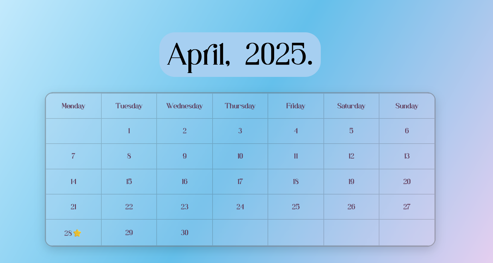

# Glass Morphism Calendar

A beautiful, minimal calendar implementation using pure HTML and CSS with a modern glass morphism design aesthetic.



## Features

- **Elegant Glass Morphism Design**: Frosted glass effect with subtle transparency and blur
- **Interactive Elements**: Calendar dates expand and highlight on hover
- **Event Tooltips**: Special dates show tooltips with event information when hovered
- **Custom Typography**: Uses the beautiful "Wasted-Vindey" font for a unique look
- **Responsive Design**: Calendar scales beautifully across different screen sizes
- **Subtle Animation**: Gentle scaling animations on hover for responsive feedback

## Preview

The calendar displays April 2025 and includes:

- A gorgeous gradient background
- Frosted glass effect for the calendar table
- Special event markers (like the birthday on April 28th)
- Tooltips that appear when hovering over dates with events

## Project Structure

```bash
calendar/
├── index.html         # The HTML structure
├── style.css          # CSS styling
├── fonts/             # Font directory
│   └── Wasted-Vindey.ttf  # Custom font file
├── .gitignore          
└── README.md          # This file
```


## Usage

1. Clone this repository or download the files
2. Open `index.html` in any modern web browser
3. Hover over dates to see the interactive effects
4. Special dates like April 1st and April 28th have tooltips

## Customization

You can easily modify this calendar by:

- Changing the month and dates in the HTML structure
- Updating the color scheme in the CSS
- Adding more events with tooltips
- Replacing the font with another of your choice

## Our Contributors

<div align = "center">
 <h3>Thank you for contributing to our repository.😃</h3>
<a href="https://github.com/sarthaksoni07/mini-calender/graphs/contributors">
  
</a>
<div>
Made with ❤️ and pure HTML/CSS.

